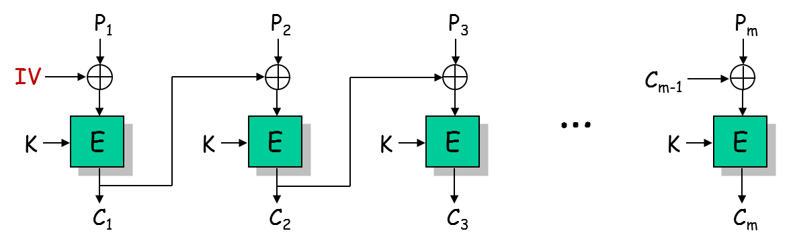
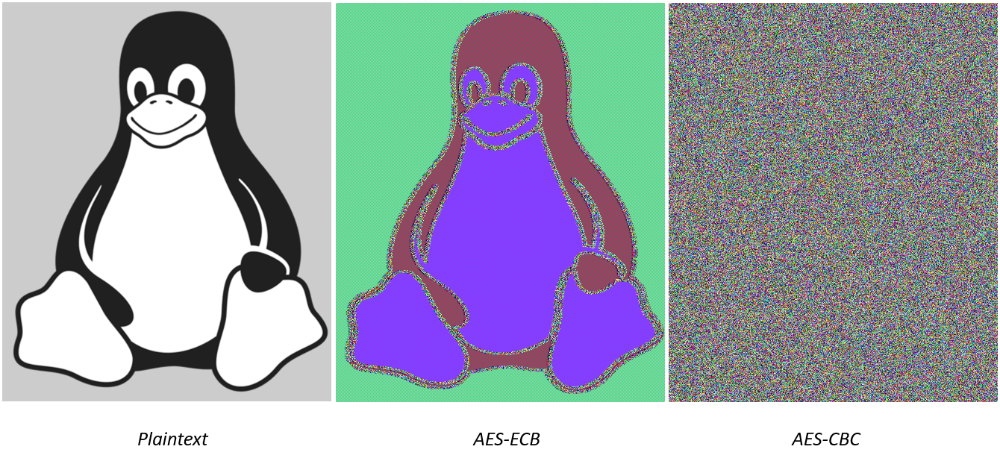
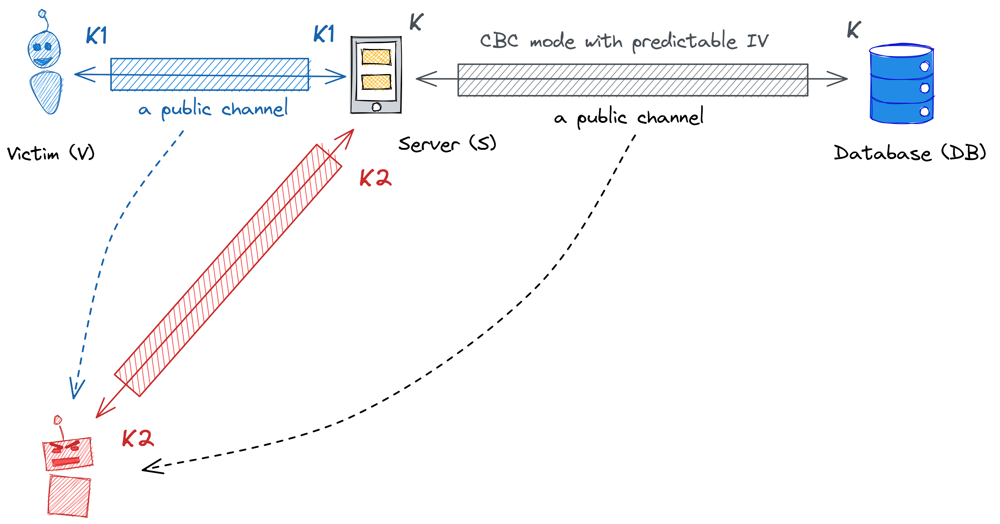

# **Kriptografija i mrežna sigurnost - Lab 4** <!-- omit in toc -->

- [CBC encryption mode and predictable initialization vector](#cbc-encryption-mode-and-predictable-initialization-vector)
  - [Predictable IV implies insecure CBC](#predictable-iv-implies-insecure-cbc)
- [Zadatak](#zadatak)
  - [Zadatak detaljno](#zadatak-detaljno)
  - [Korisne smjernice za automatizaciju u Pythonu](#korisne-smjernice-za-automatizaciju-u-pythonu)
    - [Get static file `wordlist.txt` and iterate over it](#get-static-file-wordlisttxt-and-iterate-over-it)
    - [Plaintext padding](#plaintext-padding)
    - [Coversion of bytes to hex](#coversion-of-bytes-to-hex)
    - [XOR-ing two large binary strings](#xor-ing-two-large-binary-strings)

## CBC encryption mode and predictable initialization vector

_Cipher Block Chaining (CBC)_ **probabilistički** je način enkripcije poruka primjenom blok šifri (npr., AES). Blok šifre rade s blokovima fiksne duljine (npr., AES koristi 128 bitne blokove). Poruke dulje od nominalne duljine bloka zadane šifre enkriptiramo na način da poruku podijelimo/razbijemo na više blokova prije enkripcije.

Kod CBC enkripcijskog moda _plantext_ blokovi se ulančavaju (eng. _chaining_) kako je prikazano na slici u nastavku; prisjetite se, u ECB modu pojedini blokovi enkriptiraju se neovisno.

<p align="center">

<br><br>
<em>Enkripcija u CBC modu</em>
</p>

Uz pretpostavku da se primjenjena blok šifra (npr. AES) ponaša kao **pseudo-random permutacija**, ulančavanjem se postiže _nasumičnost/randomizacija_ šifriranog _plaintext_-a. Uloga _inicijalizacijskog vektora (IV)_ je randomizacija prvog bloka _plaintext_-a. CBC enkripcijski mod osigurava povjerljivost poruka uz određene pretpostavke. Formalno govoreći, CBC mod zadovoljava svojstvo _Indistinguishability under Chosen Plaintext Attack (IND-CPA)_ - napadač ne može razlikovati koja od dvije poruke, po napadačevom izboru, je enkriptirana na osnovu _ciphertext_-a u igri koju smo opisali u okviru predavanja.

Važan preduvjet za sigurnost CBC moda je **nepredvidivost inicijalizacijskog vektora**. U nastavku je slikovito prikazana prednost CBC u odnosu na ECB mod; identična slika karakterizirana visokim stupnjem redudancije enkripritana je u ECB i CBC modu (primjenom AES blok šifre).

<p align="center">

<br>
<em>ECB vs CBC</em>
</p>

### Predictable IV implies insecure CBC

U nastavku je prikazan realan scenarij na kojem ćemo naprije teoretski pokazati ranjivost CBC enkripcijskog moda u slučaju kada se inicijalizacijski vektor bira na predvidiv način. U scenariju razlikujemo žrtvu (_victim V_) i napadača (_attacker A_), koji su oboje legitimni korisnici servera _S_. Pretpostavljamo da _V_ i _A_ imaju siguran kanal uspostavljen sa serverom. S druge strane, server _S_ podatke primljene od _V_ i _A_ enkriptira i pohranjuje u udaljenu bazu podataka _DB_. Podaci između servera i baze podataka enkripirani su u CBC modu, istim ključem, pri čemu se IV bira na predvidljiv način.

> Napadač _A_ može predvidjeti IV koji će server _S_ koristiti za enkripciju svih _plaintext_-ova. Također pretpostavljamo da napadač ima pristup svim javnim kanalima i shodno tome može saznati sve _ciphertext_-ove razmjenjene putem tih kanala.

Pretpostavimo da _V_ i _A_ ispunjavaju anketu gdje se trebaju odrediti po pitanju nekakve društveno/politički/religiozno delikatne teme sa odgovorom podržavam (_yes_) ili ne podržavam (_no_).

<p align="center">

<br>
<em>Scenario za napad na CBC mode u slučaju predvidljivog IV-a</em>
</p>

**Pretpostavke**

1. IV je predvidiv
   * IV<sub>i+1</sub> &larr; IV<sub>i</sub> + const
   * IV<sub>0</sub> se bira nasumično, a _const_ je poznata fiksna vrijednost

2. Moguće poruke od žrtve 
   * P &isin; {"yes", "no"}

3. Server koristi isti enkripcijski ključ u CBC modu za sve korisnike.

**Chosen-plaintext attack (CPA)**


|  Tko šalje  | Što šalje                                                                                  | Napomena                                                               |
| :---------: | :----------------------------------------------------------------------------------------- | :--------------------------------------------------------------------- |
| V &rarr; S  | p<sub>V</sub> = "yes" or "no"                                                              | over secure channel                                                    |
| S &rarr; DB | IV<sub>V</sub>, C<sub>V</sub> = E<sub>K</sub>(p<sub>V</sub> \|\| padding ⊕ IV<sub>V</sub>) | over CBC channel                                                       |
| A &rarr; S  | p<sub>A</sub> = "yes" \|\| padding ⊕  IV<sub>V</sub> ⊕  IV<sub>next</sub>                  | attacker A can predict IV<sub>next</sub>                               |
| S &rarr; DB | IV<sub>next</sub>, C<sub>A1</sub> = E<sub>K</sub>(p<sub>A</sub> ⊕ IV<sub>next</sub>)       | over CBC channel, C<sub>A1</sub> 1st ciphertext block of C<sub>A</sub> |

Napadač _A_ zna samo javne informacije: 

1. zna da je žrtva odabrala "yes" ili "no"
2. zna IV<sub>V</sub> i C<sub>V</sub> jer ih server šalje javnim kanalom
3. može predvidjeti IV<sub>next</sub>
4. zna C<sub>A1</sub> (prvi ciphertext block) jer ih server šalje javnim kanalom

Uvjerite se da vrijedi sljedeće: **_ako vrijedi C<sub>V</sub> == C<sub>A1</sub> onda je p<sub>V</sub> = "yes", u suprotnom p<sub>V</sub> = "no"_**.

## Zadatak

Zadatak studenta u okviru vježbe je dekriptirati odgovarajući izazov (_challenge_). Izazov je, kao i u prethodnoj vježbi, enkriptiran AES šifrom u CBC enkripcijskom modu, ključem izvedenim iz tajne vrijednosti _cookie_. Student će saznati tajni _cookie_ (potreban za dekripciju izazova) iskorištavanjem ranjivosti CBC enkripcijskog moda u slučaju kada je inicijalizacijski vektor predvidiv.

> Zadatak u koracima: _password_ &rarr; token &rarr; cookie &rarr; key &rarr; Chuck Norris fact. Prisjetite se, _password_ ste otkrili u prethodnoj vježbi.

### Zadatak detaljno

> **VAŽNO: Tajni _cookie_ je riječ odabrana nasumično iz javno dostupne liste _wordlist.txt_. Listu možete dohvatiti sa servera kao statički resurs na stazi `static/wordlist.txt`.**

Tajni _cookie_ enkriptiran je u CBC enkripcijskom modu. Enkriptiran _cookie_, uključujući odgovarajući inicijalizacijski vektor, možete dobiti slanjem HTTP GET zahtjeva _crypto oracle_ serveru na _path_ `/cbc/iv/encrypted_cookie`:

```Bash
GET /cbc/iv/encrypted_cookie
```

Kao i kod ECB moda, student će implementirati _chosen-plaintext attack (CPA)_, odnosno slati odgovarajuće _plaintext_-ove _crypto oracle_-u koji će iste enkriptirati u CBC modu i potom vraćati odgovarajući _ciphertext_ natrag studentu. _Crypto oracle_ pri navedenoj enkripciji **bira IV na predvidiv način (ne nasumično)**. Student stoga može predvidjeti IV pod kojim će njen/njegov _plaintext_ biti enkriptiran. Ranjivost opisanog postupka enkripcije proizlazi iz činjnice da student može predvidjeti prvi blok koji se enkriptira, tj., P<sub>1</sub>⊕IV<sub>next</sub>.

Koristeći ovu činjenicu, kao i činjenicu da je enkripcijski algoritam deterministička funkcija, tj., isti _plaintext_ blok rezultirat će istim _ciphertext_ blokom, student može _relativno jednostavno_ testirati potencijalne riječi iz javnog rječnika _wordlist.txt_ prilagođavanjem istih kako je opisano u prethodnom napadu i njihovim slanjem _crypto oracle_-u na enkripciju, te usporediti dobivene odgovore s _ciphertext_-om koji odgovara enkripciji _cookie_-ja.

>**VAŽNO**: U prethodnim vježbama, student je slao _plaintext_ poruke enkodirane u `utf8` formatu. Za potrebe ove vježbe _plaintext_ poruke treba enkrodirati u `hex` format (inače će server javljati da _plaintext_ nije ispravno formatiran).

### Korisne smjernice za automatizaciju u Pythonu

Možete iskoristiti popriličnu količinu koda sa prethodnih vježbi. U nastavku su navedene samo neke specifičnosti za tekuću vježbu.

#### Get static file `wordlist.txt` and iterate over it

```python
response = requests.get(url=f"http://{host}/static/wordlist.txt")    
for word in wordlist.split():
    print(f"\nTesting word: {word}")
```

#### Plaintext padding

Koristi se PKCS#7 standard kojeg smo upoznali u ranijim vježbama:

```python
from cryptography.hazmat.primitives import padding

word = b"test"

padder = padding.PKCS7(128).padder()
padded_data = padder.update(word)
padded_data += padder.finalize()
```

#### Coversion of bytes to hex

```python
b"test".hex()
```

#### XOR-ing two large binary strings

U Python-u ne možemo izravno raditi xor operaciju između podataka tipa `byte` već i trebamo prethodno convertirati u `int`.

```python
A_as_int = int.from_bytes(A_as_bytes, byteorder="big")
B_as_int = int.from_bytes(B_as_bytes, byteorder="big")

C_as_int = A_as_int ^ B_as_int

# Convert C back to 16 bytes long string
C_as_bytes = C_as_int.to_bytes(16, "big").hex()
```
