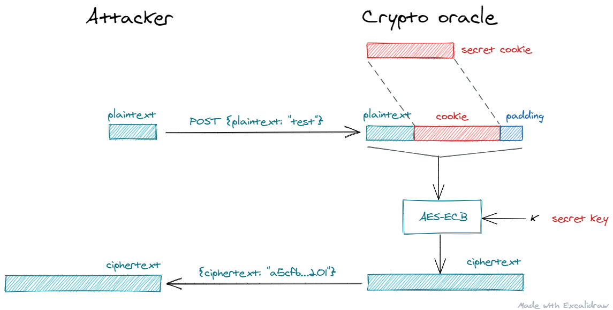

# **Kriptografija i mrežna sigurnost - Lab 3** <!-- omit in toc -->

- [ECB mode vulnerabilities](#ecb-mode-vulnerabilities)
- [Zadatak](#zadatak)
  - [Zadatak detaljno](#zadatak-detaljno)
  - [Korisne smjernice za automatizaciju u Pythonu](#korisne-smjernice-za-automatizaciju-u-pythonu)
    - [Spajanje (koncatenacija) stringova](#spajanje-koncatenacija-stringova)
    - [Iteriranje kroz string](#iteriranje-kroz-string)
    - [`requests` biblioteka](#requests-biblioteka)
    - [Dohvaćanje tokena (POST /ecb/token)](#dohvaćanje-tokena-post-ecbtoken)
    - [Slanje HTTP zahtjeva autoriziranog tokenom](#slanje-http-zahtjeva-autoriziranog-tokenom)
## ECB mode vulnerabilities

_Electronic Code Book_ (ECB) način je enkripcije poruka primjenom blok šifri kao što je AES. Budući da blok šifre rade s blokovima fiksne duljine (npr. AES koristi 128-bitne blokove), poruke koje su dulje od nominalne duljine bloka dane šifre enkriptiramo na način da poruku razbijemo na više blokova prije enkripcije. U ECB modu svaki blok se zatim enkriptira/dekriptira neovisno od drugih blokova (vidi sliku u nastavku).

<br/>
<p align="center">

<br><br>
<em>Enkripcija u ECB modu</em>
</p>

Neka je P _plaintext_ poruka duga _m_ blokova, P = P<sub>1</sub>, P<sub>2</sub>, ... , P<sub>m</sub>. U ECB enkripcijskom modu odgovarajući _ciphertext_ dobije se kako slijedi : C = C<sub>1</sub>, C<sub>2</sub>, ... , C<sub>m</sub>, uz C<sub>i</sub> = E<sub>K</sub>(P<sub>i</sub>), za i = 1, ..., m.

U vježbi ćemo pokazati da ovakav način enkripcije generalno ne osigurava povjerljivost poruke unatoč tome što koristimo siguran enkripcijski algoritam/šifru AES.

## Zadatak

Zadatak studenta u okviru vježbe je dekriptirati odgovarajući izazov (_challenge_). Izazov je, kao i u prethodnoj vježbi, enkriptiran AES šifrom u CBC enkripcijskom modu, ključem izvedenim iz tajne vrijednosti _cookie_. Student će saznati tajni _cookie_ (potreban za dekripciju izazova) iskorištavanjem ranjivosti ECB enkripcijskog moda.

> Zadatak u koracima: _password_ &rarr; token &rarr; cookie &rarr; key &rarr; Chuck Norris fact. Prisjetite se, _password_ ste otkrili u prethodnoj vježbi.

### Zadatak detaljno

U ovoj vježbi student će slati HTTP POST zahtjeve _crypto oracle_ serveru na _path_ `/ecb`, npr.:

```Bash
POST /ecb
{ "plaintext": "plaintext"}
```

> Za uspješan REST API poziv `POST /ecb` trebate odgovarajući autentikacijski token kojeg možete dobiti od _crypto_oracle_ servera u zamjenu za odgovarajuću zaporku koju ste otkrili u prethodnoj vježbi.

_Crypto oracle_ server uzima ovaj _plaintext_, spaja ga s tajnim _cookie_-jem, enkriptira rezultat (tj. `plaintext + cookie`) primjenom AES šifre u ECB modu tajnim 256 bitnim ključem (`aes-256-ecb`) i vraća vam odgovarajući _ciphertext_ (vidi sliku u nastavku).

```Bash
{"ciphertext":"ciphertext"}
```

<br/>
<p align="center">

<br><br>
<em>Primjena ECB moda u "crypto_oracle" serveru</em>
</p>

> NAPOMENA: Kao što je vidljivo iz slike, _crypto_oracle_ server će enkriptirati `plaintext + cookie + padding`; gdje se `padding` automatski dodaje iz razloga koje ćemo objasniti na predavanjima - ovaj detalj nije toliko relevantan za rješavanje zadatka.

1. Ranjivost ECB enkripcijskog moda proizlazi iz činjnice da jednostavno možete otkriti podudarnost dva _plaintext_ bloka na način da uspoređujete _ciphertext_ blokove dobivene enkripcijom tih _plaintext_ blokova. Budući da se u slučaju ECB moda radi o determinističkoj enkripciji, isti _plaintext_ blok rezultirati će istim _ciphertext_ blokom; ako se koristi isti enkripcijski ključ (naš slučaj).

2. Iskoristite prethodnu činjnicu i pokušajte ECB _crypto oracle_-u slati različite _plaintext_ poruke. Razmislite kako bi trebali prilagoditi _plaintext_ poruke da bi vam ECB _oracle_ dao potencijalno korisnu informaciju. Koristite primitivna sredstva poput olovke i papira te pokušajte sebi skicirati ovaj problem.

    > Napad u kojem adaptivno prilagođavate _plaintext_ koji šaljete _crypto_oracle_ serveru na enkripciju, od kojeg dobivate odgovarajući _ciphertext_, pada u kategoriju **chosen-plaintext** napada.

3. Tajni _cookie_ dug je 16 byte-a i čine ga slova engleskog alfabeta.

4. S obzirom da ovaj **chosen-plaintext** napad zahtjeva višekratnu interakciju (par stotina zahtjeva) sa _crypto_oracle_ serverom, pokušajte automatizirati napad prema smjernicama u nastavku.

### Korisne smjernice za automatizaciju u Pythonu

> Python skripte pokrećite u virtualnim Python okrženjima. Detaljne upute kako kreirati i aktivirati Python virtualno okruženje nalaze su u uvodnim vježbama ([Lab 1 - Setting up the stage](intro.md)).

#### Spajanje (koncatenacija) stringova

```python
print("ab" + "c")
```

#### Iteriranje kroz string

```python
for letter in "is this the real world or is this just fantasy":
    print(c)
```

#### `requests` biblioteka

Koristite `requests` biblioteku za slanje HTTP zahtjeva _crypto_oracle_ serveru. Instalirajte biblioteku (u virtualnom okruženju) kako slijedi:

```bash
pip install requests
```

#### Dohvaćanje tokena (POST /ecb/token)

```python
username = "username"
password = "password"
url = "http://your_IP_address/ecb/token"

response = requests.post(
    url=url,
    headers={
        "accept": "application/json",
        "Content-Type": "application/x-www-form-urlencoded"
    },     
    data = {
        "username": username,
        "password": password
    } 
)

# print(response.status_code)
token = response.json().get("access_token")
print(token)
```

#### Slanje HTTP zahtjeva autoriziranog tokenom

```python
# First get the token as shown above
token = "your_token"
url = "http://your_IP_address/ecb"

response = requests.post(
    url=url,
    headers={
        "accept": "application/json",
        "Authorization": f"Bearer {token}",
        "Content-Type": "application/json"
    },    
    json = {"plaintext": "xyz"}
)

# print(response.status_code)
print(response.json().get("ciphertext"))
```
