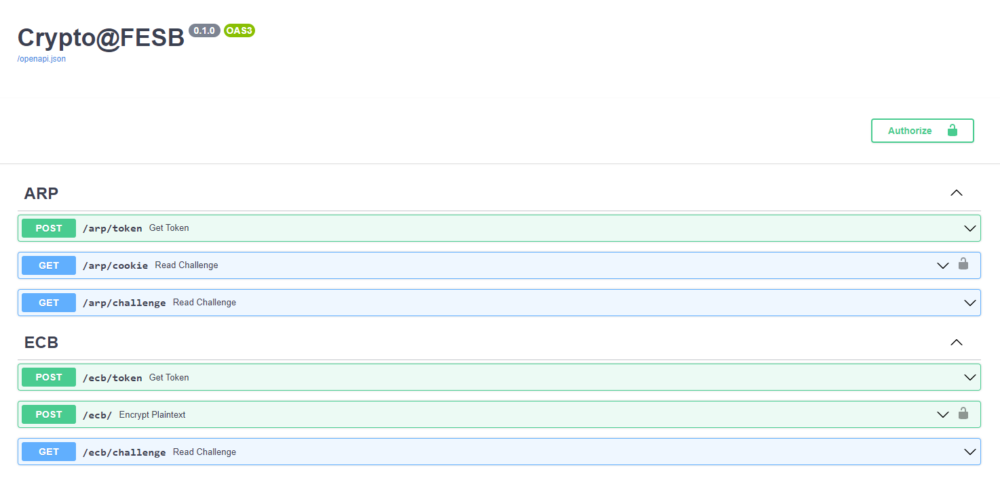
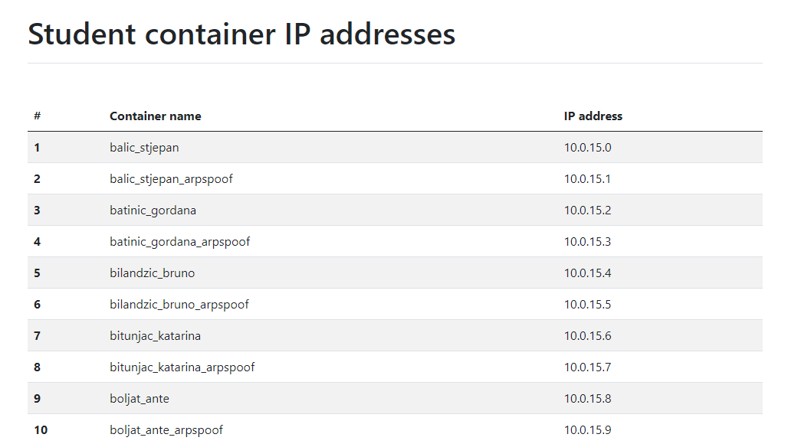
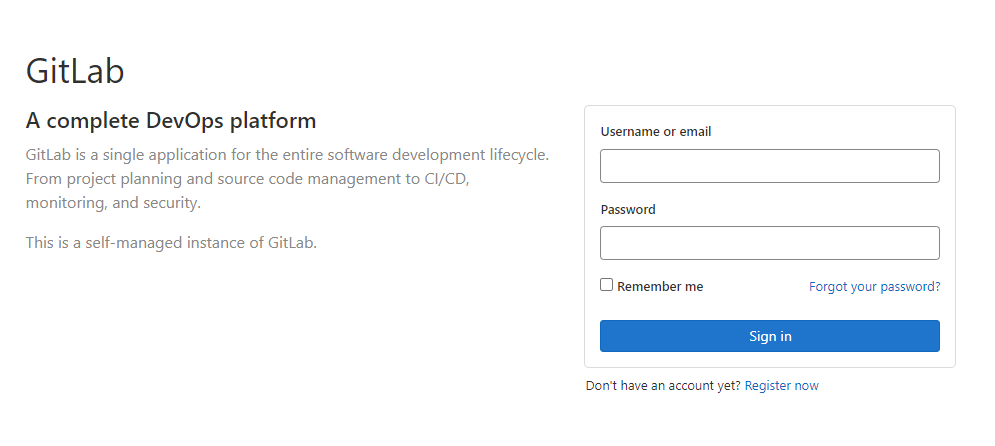

# **Kriptografija i mrežna sigurnost - Lab 1** <!-- omit in toc -->

- [Setting up the stage](#setting-up-the-stage)
  - [Uvod](#uvod)
  - [Pristup osobnom serveru](#pristup-osobnom-serveru)
  - [Pohrana rješenja (GitLab)](#pohrana-rješenja-gitlab)
  - [Python virtualno okruženje](#python-virtualno-okruženje)
- [Važni linkovi](#važni-linkovi)

## Setting up the stage

<p align="center">

<br><br>
<em>Crypto Oracle OpenAPI documentation</em>
</p>

### Uvod

Student rješava izazove u interackciji sa REST API serverom kojeg kolokvijalno nazivamo *crypto oracle*. *Crypto oracle* server generira izazove u obliku enkriptiranog teksta ([Chuck Norris facts](https://api.chucknorris.io/)) kojeg student treba dekriptirati. Dekripcijski ključ student treba otkriti u interakciji sa *crypto oracle* serverom.

> Uspješnom dekripcijom izazova, student uz novu činjenicu o Chuck Norrisu, otkriva i **zaporku** potrebnu za pristup sljedećoj vježbi.

Server je pisan u Python web okviru [FastAPI](https://fastapi.tiangolo.com/). Izvorni kod servera dostupan je u ovom repozitoriju [crypto-oracle](/crypto-oracle/). Za kriptografske potrebe korištena je Python biblioteka (*package*) [`cryptography`](https://cryptography.io).

### Pristup osobnom serveru

Za svakog studenta pokreće se personalizirana instanca *crypto oracle* servera u vidu [Docker](https://www.docker.com/) *container*-a. Za pristup osobnom serveru, student treba koristiti računalo koje ima pristup lokalnoj mreži u laboratoriju. Ovo je trenutno moguće isključivo ako ste na lokalnu mrežu povezani putem Ethernet kabela.

> Spajanjem na WiFi mrežu, ne možete ostvariti pristup personaliziranom serveru.

Osobnom serveru pristupate putem odgovarajuće IP adrese. S obzirom da se adrese dodjeljuju dinamički, podložne su promjenama. Trenutnu adresu svog servera možete doznati na adresi http://containersinfo.local.

> Sve adrese koje završavaju sa sufiksom `.local` dostupne su isključivo sa lokalne mreže (nisu javne adrese).

<p align="center">

<br><br>
<em>containersinfo.local lists student containers' IP addresses</em>
</p>
<br/>

### Pohrana rješenja (GitLab)

Nakon uspješnog rješavanja pojedine laboratorijske vježbe, student pohranjuje rješenje u odgovarajući repozitorij na loklanoj instanci GitLab servera na adresi http://gitlab.local. Rješenje uključuje dešifrirani izazov (činjenicu o Chuck Norrisu), dešifriranu zaporku (za otključavanje sljdeće vježbe), te izvorni kod kao izvorno autorsko djelo studenta.

> Student se prijavljuje na lokalni GitLab server (http://gitlab.local) s korisničkim imenom i lozinkom izvedenim iz osobnog imena (npr., studentici Ivani Ivić, dodjeljeni su identični *username* i *password*: `ivic_ivana`). Student nakon inicijalne prijave može promjeniti svoju zaporku.

<p align="center">

<br><br>
<em>Prijava na GitLab server</em>
</p>
<br/>

### Python virtualno okruženje

Preporučamo korištenje Python programskog jezika za rješavanje izazova; tehnički je moguće koristiti proizvoljan programski jezik. U svrhu izoliranja vašeg Python projekta od drugih na danom operacijskom sustavu, Python podržava kreairanje **virtualnih okruženja**. Efektno, ovo znači da svaki Python projekt može imati instalirane vlastite biblioteke (*package*), neovisno o bibliotekama drugih projekata. Tako npr., korištenjem virtualnih okruženja različiti Python projekti na istom sustavu mogu ovisiti o različitim verzijama iste biblioteke a da ne utječu jedni na druge. Broj virtualnih okruženja koje možete kreirati je praktično neograničen.

U nastavu su kratke upute za kreiranje virtualnih okruženja.

1. Uvjerite se da imate instaliran Python verzija 3. U terminalu izvršite sljedeću naredbu.

    ```bash
    python --version

    # Alternativno
    pyhton3 --version
    ```

2. Kreirajte osobni direktorij (npr. `ivic_ivana`) i uđite u njega.
3. Kreirajte odgovarajuće virtualno okruženje izvršavanjem sljedeće naredbe u terminalu.

   ```bash
   python -m venv crypto
   ```

    `crypto` je proizvoljan naziv virtualnog okruženja.

4. Aktiviranje virtualnog okruženja.

     - Windows (`cmd` terminal):
  
        ```bash
        # Nalazite se u osobnom direktoriju (npr. `ivic_ivana`)
        cd crypto\Scripts
        activate
        ```

     - Windows (`ps` terminal):
  
        ```bash
        # Nalazite se u osobnom direktoriju (npr. `ivic_ivana`)
        . .\crypto\Scripts\activate 
        ```

     - Linux:
  
        ```bash
        # Nalazite se u osobnom direktoriju (npr. `ivic_ivana`)
        source crypto/bin/activate
        ```

5. Ako je prethodni korak bio uspješan *command prompt* će dobiti prefix `(crypto)`:

   ```bash
   (crypto) C:\A507\students\ivic_ivana>
   ```

    Možete se slobodno kretati po direktorijima; virtualno okruženje će biti aktivno.

6. Svaki Python *package* koji instalirate, dok je virtualno okruženje aktivirano, biti će dostupno isključivo iz tog virtualnog okruženja i neće interferirati sa drugim virtualnim okruženjima niti globalnim sustavom.

    Instalirajte `cryptography` package u vašem virtualnom okruženju.

    ```bash
    pip install cryptography
    ```

7. Deaktivacija virtualnog okruženja. U bilo kojem direktoriju izvršite sljedeće:

    ```bash
    (crypto) C:\A507\students\ivic_ivana> deactivate
    ```

    Virtualno okruženje možete aktivirati proizvoljan broj puta.

8. Konačno, direktorij možete otvoriti u Visual Studio Code editoru kako slijedi:

    ```bash
    (crypto) C:\A507\students\ivic_ivana> code .
    ```

<br/>

## Važni linkovi

- [Python `cryptography` package](https://cryptography.io)
- [Crypto Oracle source code](/crypto-oracle/)
  
Interni linkovi (dostupni isključivo sa lokalne mreže):

- [What is my *crypto oracle* container's IP?](http://containersinfo.local)
- [Local GitLab server](http://gitlab.local)